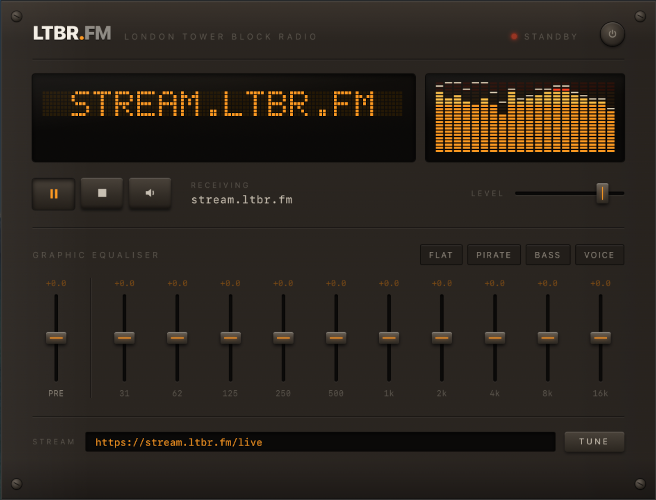

# LTBR·FM Receiver

A rock-solid, cross-platform desktop radio player for the **London Tower Block
Radio** Icecast stream — with a functional 10-band graphic equaliser and a live
LED spectrum analyser, wrapped in a brushed-metal "rack unit" interface.

**🔊 Listen right now, no install needed:** the station's web player lives at
**[www.ltbr.fm/player](https://www.ltbr.fm/player)** — this app is its
desktop counterpart, downloadable from the same page.


<p align="center">
  
</p>

## What it is

- **Native Rust audio engine.** The stream is decoded (MP3), equalised and
  mixed entirely in Rust — no reliance on the system webview's codecs, so it
  behaves identically on Linux, Windows and macOS.
- **Functional graphic EQ.** Ten bands (31 Hz – 16 kHz) plus a preamp, with
  Flat / Pirate / Bass / Voice presets. Every band actually shapes the audio.
- **Artifact-free controls.** All gains (EQ, preamp, volume, mute) are smoothed
  on the audio thread, so dragging any slider — even fast, even to the
  extremes — produces **no clicks, pops or zipper noise**.
- **Live spectrum + dot-matrix scroller** driven by the real post-EQ signal,
  including the stream's ICY "now playing" track title.
- **Resilient.** Automatic reconnection with backoff; a dropped network never
  crashes the app.

Default stream: `https://stream.ltbr.fm/live` (any Icecast/SHOUTcast MP3 URL
works — type one in the **Stream** box and press **Tune**).

## Architecture

```
Rust engine (background threads)
  reqwest ─▶ ICY metadata demux ─▶ symphonia (MP3 decode)
    ─▶ 10 biquad bands + preamp + volume   (all per-sample smoothed)
    ─▶ rubato resample → cpal output       (WASAPI / CoreAudio / ALSA)
       └▶ rustfft ─▶ 20 log bars ─▶ UI event
  state machine: standby │ tuning │ live │ error  ─▶ UI event
  ICY StreamTitle ─▶ "now playing" ─▶ UI event

Frontend (Tauri webview, vanilla TS)
  Renders the interface + canvases; sends control intents over IPC.
```

Source map:

| Area | File |
| --- | --- |
| UI wiring / IPC | `src/main.ts` |
| Canvas scroller + spectrum | `src/visuals.ts` |
| EQ / preamp / volume DSP | `src-tauri/src/dsp.rs` |
| Spectrum FFT | `src-tauri/src/spectrum.rs` |
| Network + ICY metadata | `src-tauri/src/stream.rs` |
| cpal output | `src-tauri/src/output.rs` |
| Session orchestration | `src-tauri/src/engine.rs` |
| Tauri commands | `src-tauri/src/lib.rs` |

## Controls

| Action | Control |
| --- | --- |
| Play / pause | Play button, or **Space** |
| Stop | Stop button |
| Mute | Mute button, or **M** |
| Volume | Horizontal fader (drag, arrows, double-click to reset) |
| EQ band / preamp | Vertical faders (drag, arrows, double-click to 0 dB) |
| Presets | Flat / Pirate / Bass / Voice chips |
| Change station | Type a URL → **Tune** (or **Enter**) |

## Development

Prerequisites: [Rust](https://rustup.rs), Node 18+, and the Tauri system
dependencies for your OS
([Linux/macOS/Windows guide](https://tauri.app/start/prerequisites/)).
On Debian/Ubuntu:

```bash
sudo apt-get install libwebkit2gtk-4.1-dev librsvg2-dev patchelf libasound2-dev
```

Then:

```bash
npm install
npm run tauri dev      # run in development
npm run tauri build    # produce a local installer bundle
```

## Releases

Pushing a version tag builds installers for all three platforms via GitHub
Actions (`.github/workflows/release.yml`) and attaches them to a draft Release:

```bash
git tag v0.1.0
git push origin v0.1.0
```

Produced artifacts: `.dmg` (macOS, Intel + Apple Silicon), `.msi` and NSIS
`.exe` (Windows), and `.AppImage` / `.deb` / `.rpm` (Linux).

### Code signing

Binaries are **unsigned** by default, so first launch shows an
"unidentified developer" warning. To sign & notarize, add the documented
secrets (`APPLE_*` for macOS; a Windows Authenticode certificate) referenced in
the release workflow — no workflow changes are required.

## License

MIT — see [LICENSE](LICENSE).
